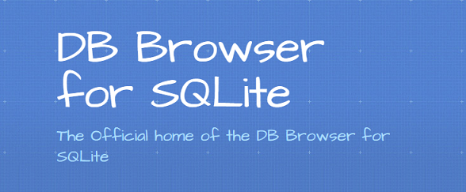

# Database (in development) 

## SQLite

> *"SQLite is an in-process library that implements a self-contained, serverless, zero-configuration, transactional SQL database engine. [...] SQLite is the most widely deployed database in the world with more applications than we can count, including several high-profile projects."*

The Web Dataset Maintenance (WDM) Tool uses SQLite to build 
SQLite is freely available at [the official SQLite website](https://www.sqlite.org/index.html).

## DB Browser for SQLite

Although a SQLite database file can be accessed and modified programmatically, it is still conveninent to use a graphical tool to browse the database file and make minor changes if needed.

For that, the current documentation recommends DB Browser for SQLite, previously known as SQLite Browser, for a graphical user interface software tool providing a to SQLite database files. It is freely downloadable from [its official website](https://sqlitebrowser.org/), which introduces DB Browser for SQLite as follows:

> *"DB Browser for SQLite is a high quality, visual, open source tool to create, design, and edit database files compatible with SQLite."*

Once DB Browser is downloaded and installed, you can use it to open SQLite database file.

## Tables
### `CombinedCounty` table
* General discription

#### Columns
* `id` (INTEGER)
* `fk_combinedcounty_indicator` (INTEGER)
* `year` (INTEGER)
* `fk_container_county` (INTEGER)
* `fk_contained_county` (INTEGER)

### `County` table
* General discription

#### Columns
* `id` (INTEGER)
* `fips_number` (REAL)
* `county_name` (TEXT)
* `judicial_circuit` (TEXT)
* `fk_county_geography` (REAL)
* `alphabetical_oder` (REAL)
* `region` (TEXT)
* `community_type` (TEXT)
* `percent_rural` (REAL)

### `Geography` table
* General discription

#### Columns
* `id` (INTEGER)
* `description` (TEXT)

### `Indicator` table
* General discription

#### Columns
* `id` (INTEGER)
* `description` (TEXT)
* `source` (TEXT)
* `note` (TEXT)
* `public_niote` (BLOB)
* `adult_or_juvenile` (TEXT)
* `fk_indicator_population_indicator` (REAL)
* `fk_indicator_ratedivisor` (REAL)
* `fk_indicator_output` (REAL)
* `name` (TEXT)

### `Note` table
* General discription

#### Columns
* `id` (INTEGER)
* `note_text` (TEXT)

### `Output` table
* General discription

#### Columns
* `id` (INTEGER)
* `source_group` (INTEGER)
* `name` (TEXT)
* `old_name` (TEXT)
* `standard` (INTEGER)
* `active` (INTEGER)
* `fk_output_package` (INTEGER)
* `name_full` (TEXT)
* `source` (TEXT)
* `year_type` (TEXT)
* `year_min` (REAL)
* `year_max` (REAL)
* `description` (TEXT)
* `notes` (TEXT)
* `column_name` (TEXT)
* `column_info` (TEXT)

### `Package` table
* General discription

#### Columns
* `id` (INTEGER)
* `name` (TEXT)

### `Population` table
* General discription

#### Columns
* `year` (INTEGER)
* `fk_population_county` (INTEGER)
* `age` (INTEGER)
* `race_gender` (INTEGER)
* `hispanic` (INTEGER)
* `value` (INTEGER)

### `PopulationOld` table
* General discription

#### Columns
* `fk_population_county` (INTEGER)
* `year` (INTEGER)
* `fk_population_indicator` (INTEGER)
* `value` (INTEGER)

### `RateDivisor` table
* General discription

#### Columns
* `id` (INTEGER)
* `description` (TEXT)

### `SimpleCount` table
* General discription

#### Columns
* `fk_simplecount_indicator` (INTEGER)
* `fk_simplecount_county` (INTEGER)
* `year` (INTEGER)
* `value` (REAL)
