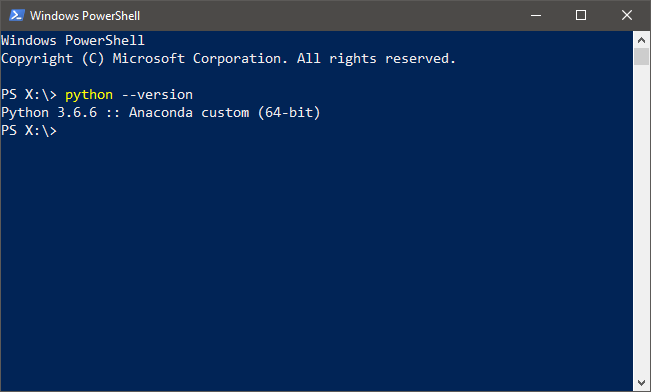

# Prerequisites

::: warning NOTE
Make sure to read the current section and follow all the described steps *prior to* trying the Web Dataset Maintenance Tool.
:::

## Download and install Python via Anaconda

### What is Python?

Python is a popular programming language that is easy to learn and ideal for a variety of projects. The following is an excerpt from ["What is Python? Executive Summary" by Python Software Foundation](https://www.python.org/doc/essays/blurb/):

> *"Python is an interpreted, object-oriented, high-level programming language with dynamic semantics. [...] Python's simple, easy to learn syntax emphasizes readability and therefore reduces the cost of program maintenance. Python supports modules and packages, which encourages program modularity and code reuse. The Python interpreter and the extensive standard library are available in source or binary form without charge for all major platforms, and can be freely distributed."*

Since the current Web Dataset Maintenance (WDM) Tool is a program written in Python, you must first install Python on your computer in order to use the WDM Tool.

::: warning NOTE
This might change in future with the WDM Tool later being complied into a Windows executabe (.exe) file to eliminate the need to install Python if possible. If you would like to try compiling the program on your own, take a look at [the PyInstaller documentation](http://www.pyinstaller.org/).
:::

### What is Anaconda?

Anaconda is a popular open source distribution of Python, which comes with commonly used packages for data analysis. The following is an excerpt from [the "Anaconda Distribution" section of the Anaconda Documentation](https://docs.anaconda.com/anaconda/):

> *"Anaconda® is a package manager, an environment manager, a Python distribution, and a collection of over 1,000+ open source packages. It is free and easy to install, and it offers free community support."*

::: warning NOTE
It is also possible to download [the official CPython distribution](https://www.python.org/downloads/) for the most basic and lightweight implementation of Python. However, the current WDM Tool documentation recommends using Anaconda, which will automatically take care of installation of additional Python packages used in the program. 
:::

### Download and install
Go to [the download page for Anaconda Windows Installer](https://www.anaconda.com/download/). You may scroll down a little to find and click the Download button for the latest available version fo Python (3.6 version at the time of writing). This will start the downloading process.

Once complete, navigate to the download location, usually the Downloads folder for a Windows PC (`C:\Users\username\Downloads`). You will find the installer with a name such as `Anaconda3-5.1.0-Windows.x86_64.exe`. Run the Anaconda installer and follow the instructions to complete the installation. You may refer to [this official documentation page on installing Anaconda on Windows](https://docs.anaconda.com/anaconda/install/windows).

::: warning NOTE
Installing a new program on your PC will require Administrator Permission. You must talk to the DoIT staff to help you on installation.
:::

## Add Python to PATH
In order to access Python from anywhere using a command-line tool, such as Command Prompt or Windows PowerShell, it is necessary to add Python to the "PATH" environmental variable.

In order to add Python to PATH, first go to Start and search for "Edit environmental variables for your account." Then choose "Path" or "PATH" variable, click "Edit" button, and add to the variable the following two locations (i.e. paths):

* `C:\ProgramData\Anaconda3\`
* `C:\ProgramData\Anaconda3\Scripts\`

::: warning NOTE
You must be logged on with your personal account when editing the PATH environmental variable.
:::

Once you apply the change, Python should be accessible from anywhere on your PC. You may test this by opening a command-line tool, and execute `python --version` as in the following image:

If the relevant output is printed without causing any error, Python is successfully added to PATH.

::: tip
The current WDM Tool documentation recommends using Windows Powershell for running the program although other command-line tools (e.g. Commend Prompt or Git Bash) can be used to run the program just the same.

You can open PowerShell anywhere on the PC. Simply hold a `Shift` key, press the right mouse button (right click), and choose the "Open PowerShell window here" option.
:::

## Set up the P:\ network drive
The current documentation assumes that you have access to the `\\MAINFILESRV` network drive, which serves as a main storage for the R&A Unit and is conventionally mapped to `P:\` on a staff member's workstation. In fact, the WDM Tool is located at the `P:\DATA\CJIA_Webdata\` directory. 

Therefore, before proceeding to the rest of the documentation, make sure you have access to `\\MAINFILESRV\r&a\` and the network drive is correctly mapped to `P:\`. Contact the DoIT staff for help if needed.